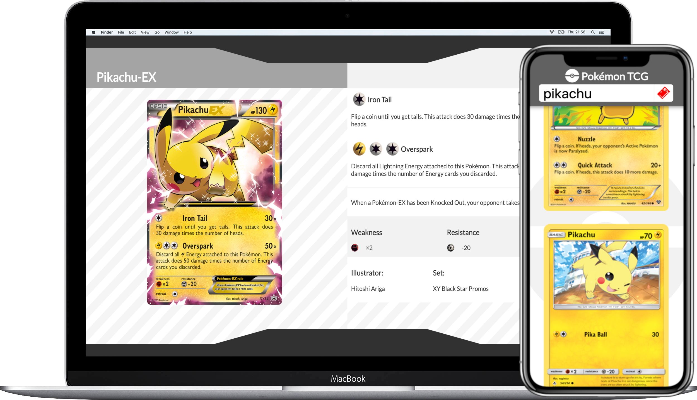
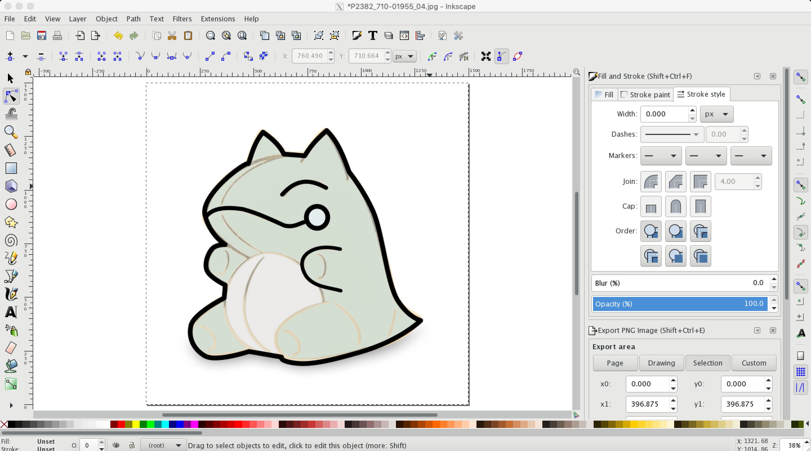

# Pokémon TCG

## Descriptions:

An application which allows users to search their favorite Pokémon cards.

## Live Demo

https://pokemontcg-gabe.herokuapp.com/

## Preview:





## Getting Started:

These instructions will get a copy of the project up and running on your local machine for usage and testing purposes.

clone down the repository:
```
$ git https://github.com/Inzurriaga/pokemon-tcg
```

cd into directory and run npm install:
```
$ npm install
```

launch in your browser:
```
$ npm run
```

## Project Tools:
HTMl\
Javascript\
CSS\
React\
Redux\
Sass\
React Router

## Contributors
Gabriel Inzurriaga: https://github.com/Inzurriaga
